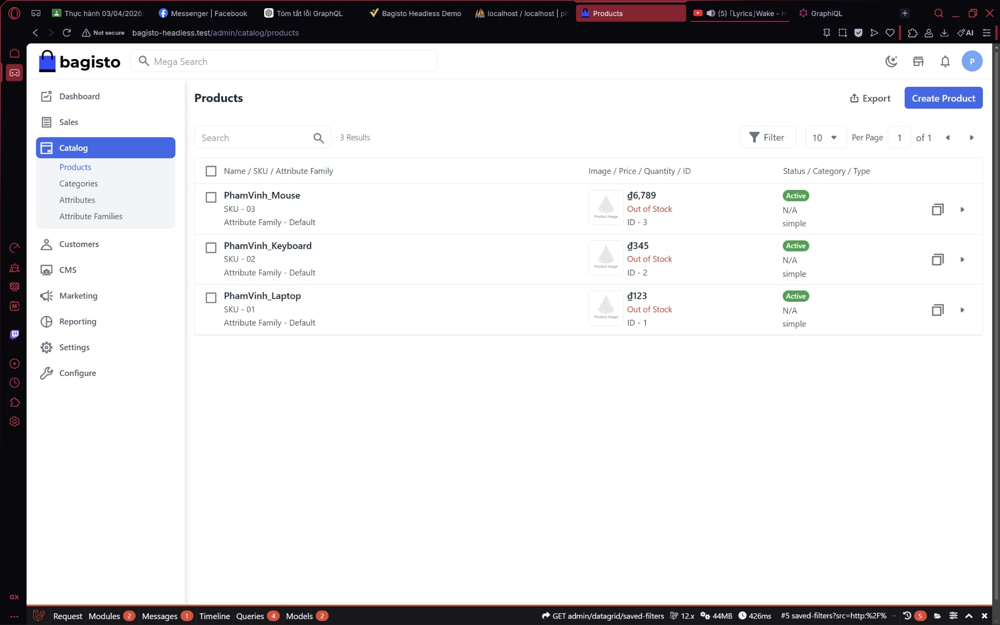
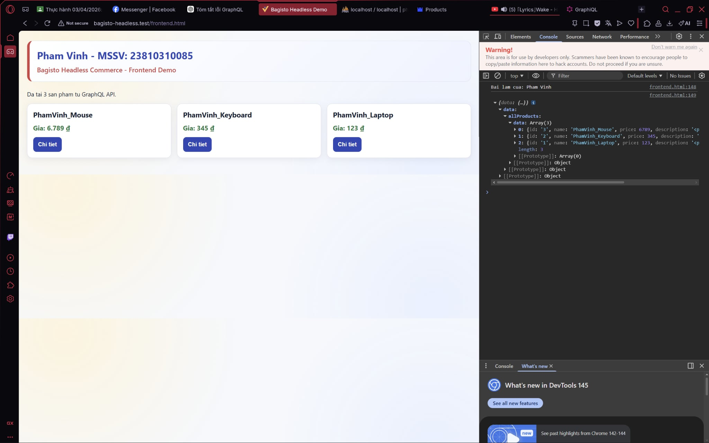
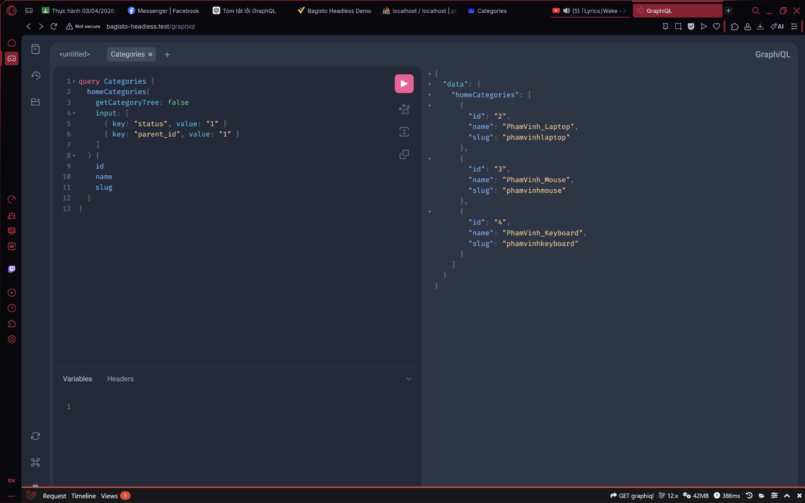
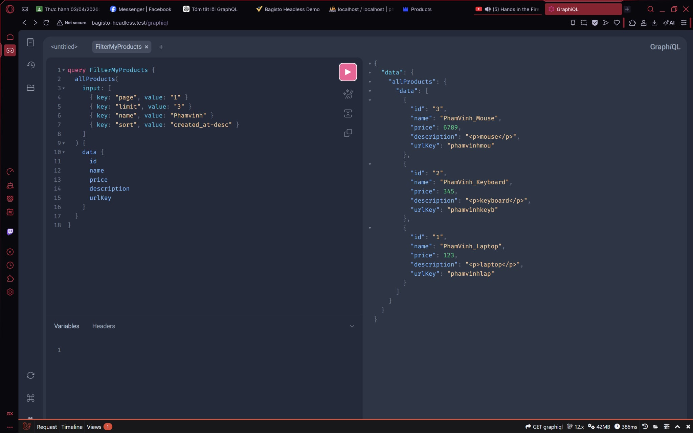
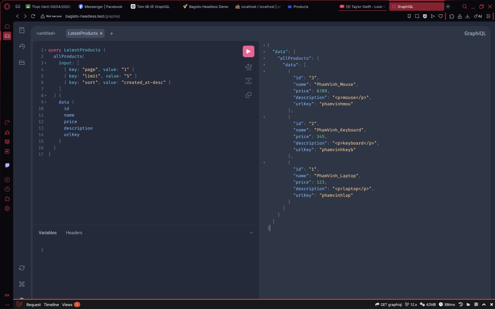

Phạm Tiến Vinh - 23810310085

So sánh lưu lượng dữ liệu:
Dùng REST API khi lấy tất cả trường của sản phẩm sẽ trả về toàn bộ dữ liệu, bao gồm nhiều trường không cần thiết, dẫn đến payload lớn hơn và tốn băng thông. Trong khi đó, GraphQL cho phép chỉ định trường cần lấy, nên payload nhỏ hơn, tối ưu tốc độ và băng thông.

Thay đổi giá sản phẩm qua Headless API:
Em sẽ sử dụng Mutation, vì Mutation trong GraphQL được thiết kế để thay đổi dữ liệu trên server (tạo, cập nhật, xóa). Query chỉ dùng để truy xuất dữ liệu, không gây thay đổi trạng thái server.